# 자바 개발자를 위한 코틀린 입문(Java to Kotlin Starter Guide)

## 섹션1. 코틀린에서 변수와 타입, 연산자를 다루는 방법

### 1강. 변수 선언 키워드 - var과 val의 차이점

- var - variable(가변) / val - value(불변)
- 코틀린에서는 모든 변수에 수정 가능 여부(var / val)를 명시해주어야 한다.
- 타입, 초기값을 지정하지 않으면 컴파일 에러가 발생 ⇒ 지정해줘야 함
- 모든 변수는 우선 val(불변)으로 만들고 꼭 필요한 경우 var(가변)으로 변경한다.

- primitive type, reference type → 코틀린에서는 상황에 따라서 내부적으로 primitive type로 바꿔서 처리해준다.
- 즉, boxing/unboxing을 고려하지 않아도 되도록 코틀린이 알아서 처리해준다.

**정리**

- 모든 변수는 var / val을 붙여 주어야 한다.
    - var: 변경 가능하다. / val: 변경 불가능하다(read-only)
- 타입을 명시적으로 작성하지 않아도, 타입이 추론된다.
- Primitive Type과 Reference Type을 구분하지 않아도 된다.
- Null이 들어갈 수 있는 변수는 타입 뒤에 ? 를 붙여주어야 한다.
    - 아예 다른 타입으로 간주된다.
- 객체를 인스턴스화 할 때 new를 붙이지 않아야 한다.

### 2강. 코틀린에서 null을 다루는 방법

1. 코틀린에서 null 체크
2. safe call과 elvis 연산자

   safe call

    - ?. 를 쓰면 실행시키면 가능

   elvis 연산자 - 앞의 연산 결과가 null이면 뒤의 값을 사용

    - ?: 쓰면 앞이 null이면 뒤의 값(0)을 사용

3. 널 아님 단언!!
    - nullable type이지만, 아무리 생각해도 null이 될 수 없는 경우

    - 혹시나 null이 들어오면 null point exception이 나오기 때문에, 정말 null이 아닌게 확실한 경우에만 널 아님 단언!!을 사용해야 한다.
4. 플랫폼 타입
    - null 관련 정보를 알수 없을 때 사용

### 3강. 코틀린에서 Type을 다루는 방법

1. 기본타입 → 타입 변환을 `명시적` 으로 이루어저야 함 (자바는 `암시적`으로 변경됨)

   Byte
   Short**Int
   Long
   Float
   Double**
   부호 없는 정수들

2. 타입 캐스팅

    - 한번 코틀린 컴파일러가 컨텍스트를 분석해가지고 if 안에는 들어왔는데 if에서 타입 체크를 해줬음 → 그러면 이 타입으로 간주될 수 있겠구나라고 인지함
3. kotlin의 3가지 특이한 타입
    1. Any
        - **Java의 Object 역할**. 모든 객체의 **최상위 타입**
        - 모든 Primitive Type의 최상의 타입도 Any이다.
        - null을 포함하고 싶으면, `Any?` 로 표현
        - Any에 equals / hashCode / toString 존재
    2. Unit
        - **Java의 void와 동일한 역할**
    3. Nothing
        - **함수가 정상적으로 끝나지 않았다**는 사실을 표현하는 역할
        - 무조건 예외를 반환하는 함수 / 무한 루프 함수

       → 실제로 코딩에서 쓰진 않음

4. String Interpolation, String indexing

    - 변수 이름만 사용하더라도 `${변수}` 를 사용하는 것이 아래의 이유로 좋다.
        - 가독성
        - 일괄 변환
        - 정규직 활용
    - 문자열에서 특정 문자 가져오기 ⇒ *println*(str[0])

### 4강. 코틀린에서 연산자를 다루는 방법

1. 단항 연산자 / 산술 연산자 ⇒ 같음
2. 비교 연산자와 동등성, 동일성
    - 사용법은 Java와 같다.
    - Java와 다르게 객체를 비교할 때, 비교 연산자를 사용하면 자동으로 `compareTo`를 호출해준다.

    - 동등성: 두 객체의 값이 같은가
    - 동일성: 완전히 동일한 객체인가(주소값이 같은가)
3. 논리연산자 / 코틀린에 있는 특이한 연산자 → 반복문에서 자세히 배울 예정
    - in / !in
    - a..b
    - a[i]
    - a[i] = b
4. 연산자 오버로딩
    - 코틀린에서는 객체마다 연산자를 직접 정의할 수 있음

    ```kotlin
    fun main() {
        val money1 = Money(1_000L)
        val money2 = Money(2_000L)
        println(money1 + money2) // Money(amount=3000)
    }
    ```

## 섹션2. 코틀린에서 코드를 제어하는 방법

### 5강. 코틀린에서 조건문에서 다루는 방법

1. if-else문
2. Expression과 Statement
    - 자바는 Statement(프로그램의 문장, 하나의 값으로 도출되지 않음)
    - 코틀린은 Expression(하나의 값으로 도출되는 문장)
    - 코틀린에서는 if-else문을 expression으로 사용할 수 없기 때문에 3항 연산자가 없음
        - switch 대신 when을 써주고 return문을 맨 앞에 써줄 수 있음

    ```kotlin
    fun getPassOrFail(score: Int): String {
        return if (score >= 50) {
            "P"
        } else {
            "F"
        }
    }
    
    fun getGrade(score: Int): String {
        return if (score >= 90) {
            "A"
        } else if (score >= 80) {
            "B"
        } else if (score >= 70) {
            "C"
        } else {
            "D"
        }
    }
    ```

3. switch 과 when
    - 맨 앞에 return 문을 써준다.

    ```kotlin
    fun getGradeWithSwitch(score: Int): String {
        return when (score / 10) {
            9 -> "A"
            8 -> "B"
            7 -> "C"
            else -> "D"
        }
    }
    
    fun getGradeWithSwitch(score: Int): String {
        return when (score / 10) {
            in 90..99 -> "A"
            in 80..89 -> "B"
            in 70..79 -> "C"
            else -> "D"
        }
    }
    ```

    ```kotlin
    when (값) {
        조건부 -> 어떠한 구문
      조건부 -> 어떠한 구문 
      else -> 어떠한 구문
    }
    ```

    - 조건부에서는 어떠한 expression이라도 들어갈 수 있다. (ex. is Type)

    ```kotlin
    fun getGradeWithSwitch(score: Int): String {
        return when (score / 10) {
            in 90..99 -> "A"
            in 80..89 -> "B"
            in 70..79 -> "C"
            else -> "D"
        }
    }
    ```

    - 값 → 값이 없을 수 있다.

    ```kotlin
    fun judgeNumber2(number: Int) {
        when {
            number == 0 -> println("주어진 숫자는 0입니다.")
            number % 2 == 0 -> println("주어진 숫자는 짝수입니다.")
            else -> println("주어지는 숫자는 홀수입니다.")
        }
    }
    ```

### 6강. 코틀린에서 반복문을 다루는 방법

1. for-each 문
2. 전통적인 for문
3. Progression과 Range
    - .. 연산자: 범위를 만들어 내는 연산자 → 등차수열을 만들어줌
    - ex. 1..5 step 2: 시작값 1, 끝값 5, 공차 2인 등차수열

4. while문

### 7장. 코틀린에서 예외를 다루는 방법

1. try catch finally 구문

   예시. 주어진 문자열을 정수로 변경하는 예제

2. checked exception, unchecked exception
    - 코틀린에서는 throw 구문이 없다는 점
        - Checked Exception과 UnChecked Exception을 구분하지 x
        - 모두 `UncheckException`으로 본다.
3. try with resources
    - 코틀린에서는 이러한 구문이 없지만, `use`라는 inline 확장함수를 사용해야 한다.

### 8장. 코틀린에서 함수를 다루는 방법

1. 함수 선언 문법
    - 함수는 클래스 안에, 파일 최상단에 있을 수 있다. 또한, 한 파일안에 여러 함수들이 있을 수 있다.
2. default parameter

    - 물론 코틀린에서도 자바와 동일하게 오버로드 기능은 있다.
3. named argument = 이름있는 파라미터

- Lecture8 - 결과

    ```kotlin
    package lec08
    
    fun main() {
        repeat("Hello World!")
        repeat("Hello World!", 3, true)
        repeat("Hello World!", useNewLine = false)
    }
    
    fun repeat(
        str: String, num: Int = 3, useNewLine: Boolean = true
    ) {
        for (i in 1..num) {
            if (useNewLine) {
                println(str)
            } else {
                print(str)
            }
        }
    }
    ```

- builder를 직접 만들지 않고 builder의 장점을 가지게 된다.

    ```kotlin
    fun main() {
        printNameAndGender(name = "MALE", gender = "팬시")
    }
    
    fun printNameAndGender(name: String, gender: String) {
        println(name)
        println(gender)
    }
    ```

1. 같은 타입의 여러 파라미터 받기 (가변인자)
    - 배열을 바로 넣는 대신 스프레드 연산자(*)을 붙여줘야 한다.

    ```kotlin
    package lec08
    
    fun main() {
        var array = arrayOf("A", "B", "C")
        printAll(*array)
    }
    
    fun printAll(vararg strings: String) {
        for (str in strings) {
            println(str)
        }
    }
    ```

## 섹션3. 코틀린에서의 OOP

### 9장. 코틀린에서 클래스를 다루는 방법

1. 클래스와 프로퍼티

- 프로퍼티 = 필드 + getter, setter
- 코틀린에서는 필드만 만들면 getter, setter를 자동으로 만들어준다.

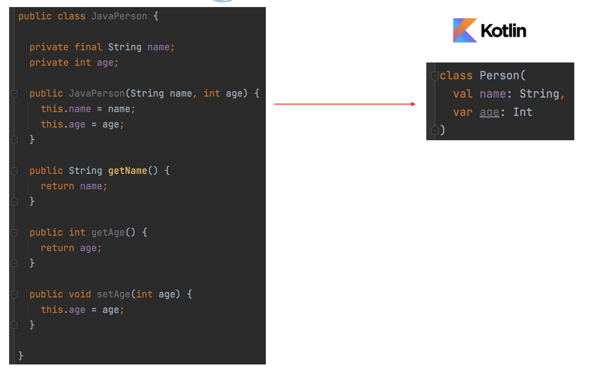

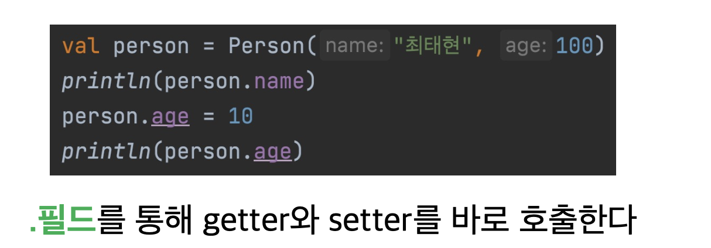

2. 생성자와 init

- 주생성자 - 반드시 존재, 단 주생성자에 파라미터가 하나도 없으면 생략 가능

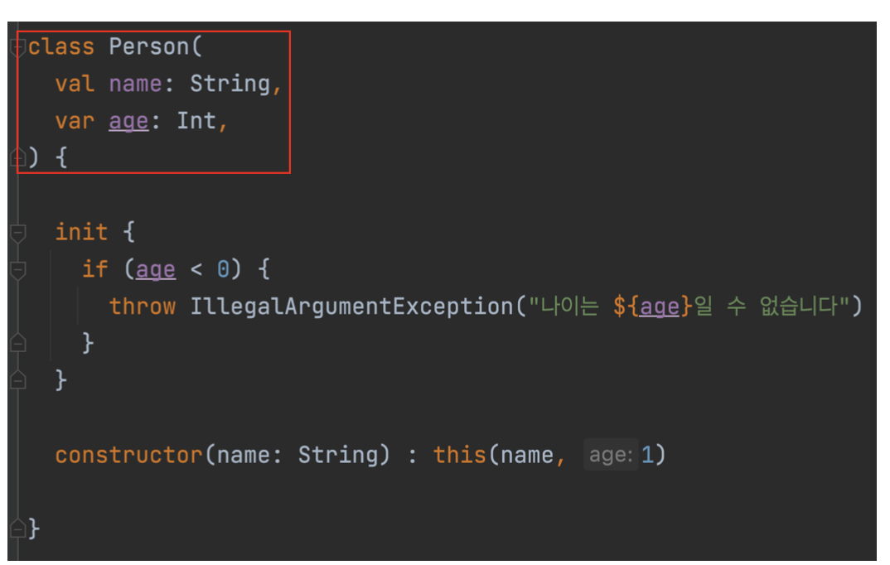

- 부생성자 - 있을수 있고, 없을 수 있다.
- **최종적**으로 주생성자를 this로 호출해야 한다. → body를 가질 수 있다.

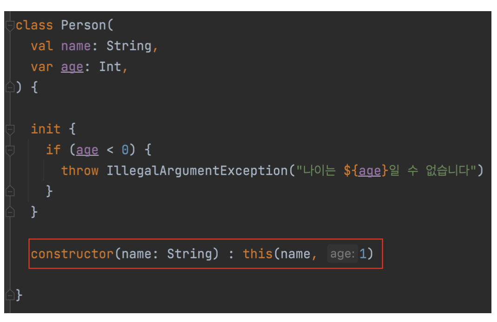

- 본문은 역순으로 실행됨
    - “두 번째 부생성자”를 먼저 호출하지만, 반환은 “초기화 블록” 부터 실행된다.
    - Converting과 같은 경우 부생성자를 사용할 수 있지만, 그보다는 정적 팩토리 메소드를 추천 드린다 → 실무에서는 부생성자를 잘 사용하지 않음

    ```kotlin
    package lec09
    
    fun main() {
        Person()
    }
    
    class Person0 constructor(name: String, age: Int) {
        var name = name;
        var age = age;
    }
    
    class Person(
        var name: String,
        var age: Int
    ) {
        init {
            if (age <= 0) {
                throw IllegalArgumentException("나이는 ${age}일 수 없습니다.")
            }
    			println("초기화 블록")
        }
    
        constructor(name: String) : this(name, 1) {
            println("첫 번째 부생성자")
        }
    
        constructor() : this("팬시") {
            println("두 번째 부생성자")
        }
    }
    // 결과
    초기화 블록
    첫 번째 부생성자
    두 번째 부생성자
    ```

3. 커스텀 getter, setter

- 함수로 하는 방법과 프로퍼티로 하는 방법이 있음 ⇒ 두 방법 모두 동일한 기능
- 객체의 속성이라면 custom getter, 그렇지 않으면 함수로 작성한다.
- custom getter를 사용하면 자기 자신을 변경해줄 수도 있다.

4. backing field

- 왜 field를 사용하는 걸까?

   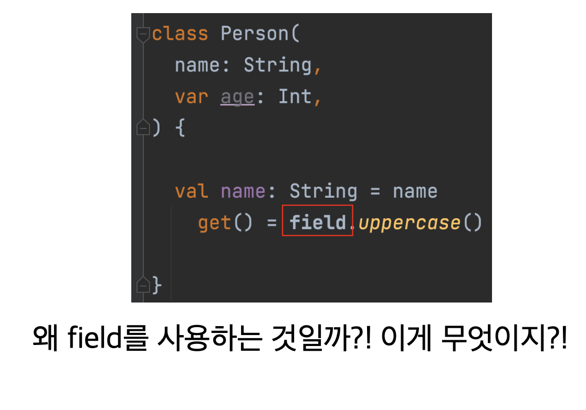
    
- name은 getter를 부른다 ⇒ 무한루프 발생
    
  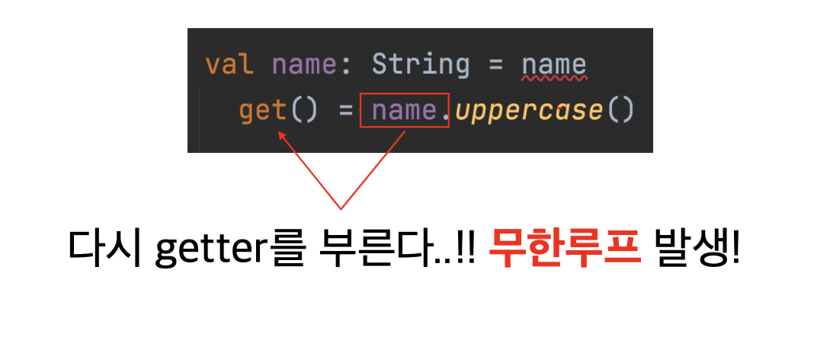
    
- 무한루프 막기위한 예약어
    
  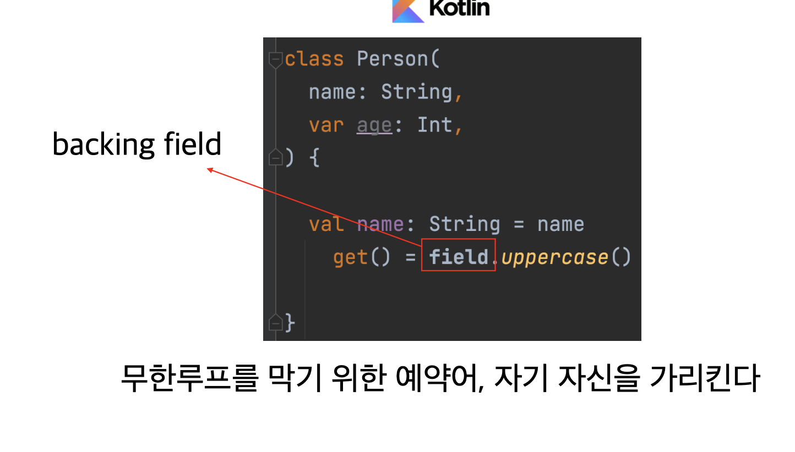

**정리**

- 코틀린에서는 필드를 만들면 getter와 (필요에 따라) setter가 자동으로 생긴다.
- 이를 ‘프로퍼티’라고 부른다.

    ```kotlin
    class Person (
    var name: String = "팬시", 
    var age: Int = 1
    )
    ```

- 코틀린에서는 `주생성자`가 필수이다.
- 커스텀 키워드를 부생성자를 추가로 만들 수 있지만, `default parameter`나 `정적 팩터리 메서드`를 추천한다.
- 실제 메모리에 존재하는 것과 무관하게 custom getter와 custom setter를 만들 수 있다.
- custom getter, custom setter에서 무한루프를 막기 위해 `field`라는 키워드를 사용한다.
- 이를 **backing field** 라고 부른다.

### 10장. 코틀린에서 상속을 다루는 방법

1. 추상 클래스

- Animal이란 추상 클래스를 구현한 Cat, Penguin

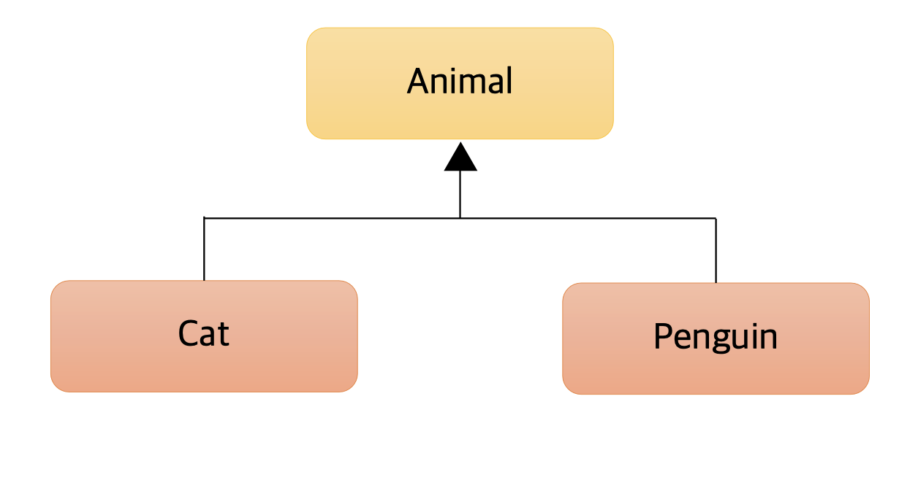

- extend 키워드를 사용하지 않고, : 를 사용한다.
- 상위 클래스의 생성자를 바로 호출한다.
- override를 필수적으로 붙여줘야 한다.

```java
// Java
package lec10;

public class JavaCat extends JavaAnimal {

    public JavaCat(String species) {
        super(species, 4);
    }

    @Override
    public void move() {
        System.out.println("고양이가 사뿐 사뿐 걸어가~");
    }

}
```

```kotlin
// Kotlin
package lec10

class Cat(
    species: String
) : Animal(species, 4) {

    override fun move() {
        println("고양이가 사뿐 사뿐 걸어가~")
    }
}
```

- 프로퍼티에 대한 오버라이딩을 할 때에는 추상 프로퍼티가 아니라면, 상속받을 때 `open`을 꼭 붙어야 한다.

```kotlin
package lec10

abstract class Animal(
    protected val species: String,
    protected open val legCount: Int,
) {
    abstract fun move()
}
```

```kotlin
package lec10

class Penguin(
    species: String
) : Animal(species, 2) {

    private val wingCount: Int = 2

    override fun move() {
        println("팽귄이 움직입니다~ 꿱꿱")
    }

    override val legCount: Int
        get() = super.legCount + this.wingCount
}
```

- 자바와 코틀린 모두 추상 클래스는 인스턴스화 할 수 없다.

2. 인터페이스

- Flyable, Swimmable 인터페이스를 구현한 Penguin
- 인터페이스 구현도 `:` 을 사용한다.

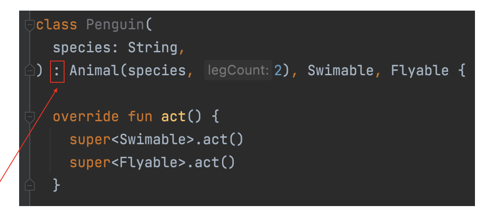

```kotlin
class Penguin(
    species: String
) : Animal(species, 2), Swimable, Flyable {

    private val wingCount: Int = 2

    override fun move() {
        println("팽귄이 움직입니다~ 꿱꿱")
    }

    override val legCount: Int
        get() = super.legCount + this.wingCount

    override fun act() {
        super<Swimable>.act()
        super<Flyable>.act()
    }

    override val swimAbility: Int
        get() = 4
}
```

- 자바와 코틀린 모두 인터페이스를 인스턴스화 할 수 없다.
- Kotlin에서는 backing field가 없는 프로퍼티를 Interface에 만들 수 있다.

3. 클래스를 상속할 때 주의할 점

- 아래 클래스를 실행하게 되면 결과가 300, 100도 아닌 0이 나온다. → 왜 그럴까

```kotlin
  package lec10

fun main() {
    Derived(300)
}

open class Base(
    open val number: Int = 100
) {
    init {
        println("Base Class")
        println(number)
    }
}

class Derived(
    override val number: Int
) : Base(number) {
    init {
        println("Derived Class")
    }
}
```

- 상위 클래스를 호출하게 되면, 하위 클래스에 있는 넘버를 가져온다.
- 근데 아직 상위 클래스에 constructor가 먼저 실행된 단계라서, 하위 클래스에 number라는 값에 초기화가 이루어지지 않은 것임
- 그 상태에서 먼저 하위 클래스의 number에 접근하므로 결과가 0이 된 것임
- 따라서, 상위 클래스를 설계할 때 생성자 또는 초기화 블록에 사용되는 **프로퍼티는 open을 피해야 한다.**

4. 상속 관련 지시어 정리

- final: override를 할 수 없게 한다. → 클래스, 프로퍼티 (default로 보이지 않게 존재한다.)
- open: override를 열어준다
- abstract: 반드시 override 해야한다.
- override: 상위 타입을 오바라이드 하고 있다. → 코틀린에서는 어노테이션이 아니라 키워드로 사용해야 한다.

**정리**

- 상속 또는 구현을 할 때 `:` 을 사용해야 한다.
- 상위 클래스 상속을 구현할 때 생성자를 반드시 호출해야 한다.
- override를 필수로 붙여야 한다.
- 추상 멤버가 아니면 기본적으로 오버라이드가 불가능하다.
    - **`open`** 을 사용해주어야 한다.
- 상위 클래스의 생성자 또는 초기화 블록에서 open 프로퍼티를 사용하면 얘기치 못한 버그가 생길 수 있다.

### 11장. 코틀린에서 접근 제어를 다루는 방법

1. 자바와 코틀린의 가시성 제어
    - 자바와 코틀린 차이

   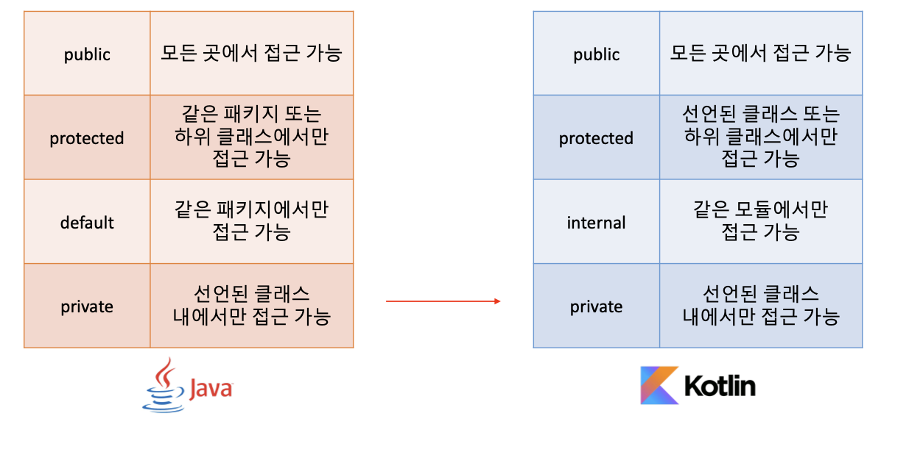

    - 코틀린에서는 패키지를 namespace를 **관리하기 위한 용도**로만 사용! → 가시성 제어에는 사용되지 않음 ⇒ 영역을 나누기 위한 용도로만 사용
    - default 대신 internal로 사용(같은 모듈) → 모듈: 한 번에 컴파일 되는 Kotlin 코드
        - IDEA Moduel, Maven Projexct, Gradle Source Set
    - public, private은 자바와 동일 / protected, internal 부분만 다름
    - 코틀린의 기본 접근 지시어가 `public` 임
2. 코틀린 파일의 접근 제어
    - 또한,  **.kt 파일에 변수, 함수, 클래스 여러개를 바로 만들 수 있다.**

   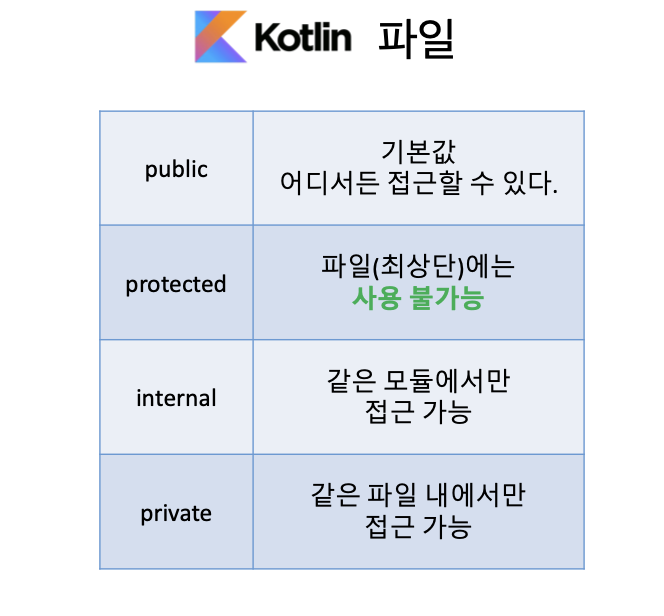

3. 다양한 구성요소의 접근 제어 - 클래스, 생성자, 프로퍼티
    - 클래스 → 자바와 동일

    - 생성자도 가시성의 범위는 동일, 단 생성자에 접근 지시어를 붙이려면 `constructor`를 써줘야 한다. → 원래는 public constructor가 생략되어 있는데, private,
      protected, internal 이면 뒤에  `constructor` 를 붙여줘야 한다.
    - 프로퍼티 - 2가지 Case

   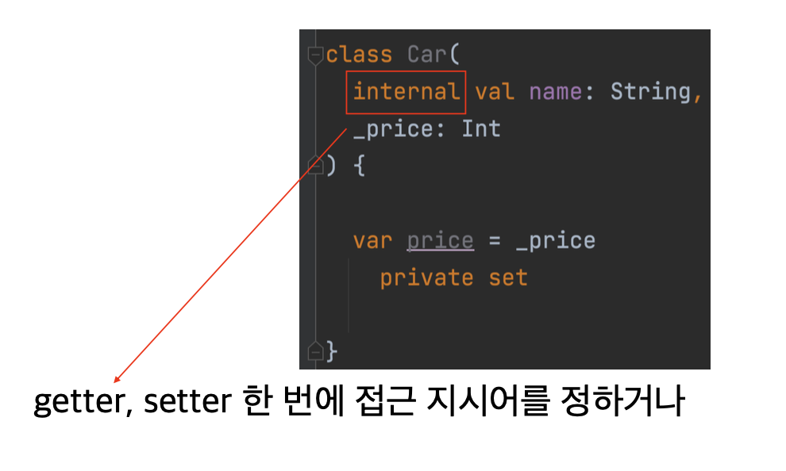

   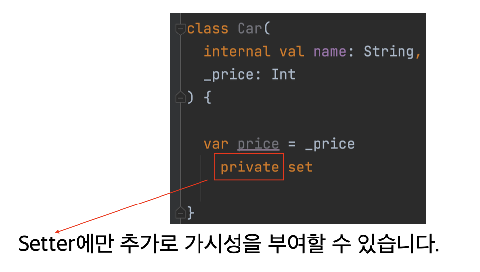

    ```kotlin
    class Car(
        internal val name:String,
        private var owner: String,
        _price: Int
    ) {
        var price = _price
            private set
    }
    ```

4. Java와 Kotlin을 함께 사용할 경우 주의할 점
    - Internal은 바이트 코드 상 public 상이 된다. → 때문에 Java 코드에서는 Kotlin 모듈의 internal 코드를 가져올 수 있다.
    - Kotlin의 protected와 Java의 protected는 다름 → Java는 같은 패키지의 Kotlin protected 멤버에 접근할 수 있다.

**정리**

- Kotlin에서 패키지는 namespace 관리용이기 때문에
  protected는 의미가 달라졌다.
- Kotlin에서는 default가 사라지고, 모듈간의 접근을 통제하는
  internal이 새로 생겼다.
- 생성자에 접근 지시어를 붙일 때는 constructor를 명시적으로
  써주어야 한다.
- 유틸성 함수를 만들 때는 파일 최상단을 이용하면 편리하다.
- 프로퍼티의 custom setter에 접근 지시어를 붙일 수 있다.
- Java에서 Kotlin 코드를 사용할 때 internal과 protected는 주의해야 한다.

### 12장. 코틀린에서 object 키워드를 다루는 방법

1. static 함수와 변수

- 코틀린에서는 `static` 이라는 함수가 없어서, 이 대신에 `companion object` 키워드를 사용한다.
    - `static` : 정적으로 인스턴스끼리 값을 공유
    - `companion object` : 클래스와 동행하는 유일한 오브젝트(객체)
- Java

    ```java
    public class JavaPerson {
    
        private static final int MIN_AGE = 1;
    
        public static JavaPerson newBaby(String name) {
            return new JavaPerson(name, MIN_AGE);
        }
    
        private String name;
    
        private int age;
    
        private JavaPerson(String name, int age) {
            this.name = name;
            this.age = age;
        }
    
    }
    
    ```

- Kotlin
    - 일반적으로 `val` 은 **런타임 시에 변수가 할당**되지만, val 앞에 `const`를 붙이게 되면 **컴파일 시에 변수가 할당**된다. → 이는 진짜 상수에 붙이기 위한 용도 / 기본적으로 기본
      타입과 String에 붙일 수 있다.

    ```kotlin
    class Person private constructor(
        var name: String,
        var age: Int,
    ) {
        companion object {
            val MIN_AGE = 1
            fun newBaby(name:String): Person {
                return Person(name, MIN_AGE)
            }
        }
    }
    ```

    - Java에서 Kotlin companion object를 사용하려면 `@JvmStatic` 을 붙여야 한다.

    ```kotlin
    package lec12
    
    fun main() {
    
    }
    
    class Person private constructor(
        var name: String,
        var age: Int,
    ) {
        companion object {
            private const val MIN_AGE = 1
            
            @JvmStatic
            fun newBaby(name:String): Person {
                return Person(name, MIN_AGE)
            }
        }
    }
    ```


2. 싱글톤

- 싱글톤: 단 하나의 인스턴스만을 갖는 클래스

    ```java
    public class JavaSingleton {
    
        private static final JavaSingleton INSTANCE = new JavaSingleton();
    
        private JavaSingleton() {
        }
    
        public static JavaSingleton getInstance() {
            return INSTANCE;
        }
    
    }
    
    ```

- 코틀린에서 싱글톤을 사용하려면 앞에 `object`를 붙여주면 된다.

    ```kotlin
    fun main() {
        println(Singleton.a)
        Singleton.a += 10
        println(Singleton.a)
    }
    
    object Singleton {
        var a: Int = 0
    }
    ```


3. 익명 클래스

- 익명 클래스: 특정 인터페이스나 클래스를 상속받은 구현체를 일회성으로 사용할 때 쓰는 클래스
- 자바에서는 new 타입 이름(), 코틀린에서는 `object: 타입이름` 으로 사용한다.

    ```kotlin
    package lec12
    
    fun main() {
        moveSomething(object : Movable {
            override fun move() {
                println("무브 무브")
            }
    
            override fun fly() {
                println("날다 날다")
            }
        })
    }
    
    private fun moveSomething(movable: Movable) {
        movable.move()
        movable.fly()
    }
    ```

### 13장. 코틀린에서 중첩 클래스를 다루는 방법

중첩 클래스는 실무에서 거의 사용x

1. 중첩 클래스의 종류
    - `static 클래스`: **밖의 클래스를 직접 참조 불가능하다.**
    - `내부 클래스`: 클래스 안의 클래스로, **밖의 클래스를 직접 참조 가능하다.**

   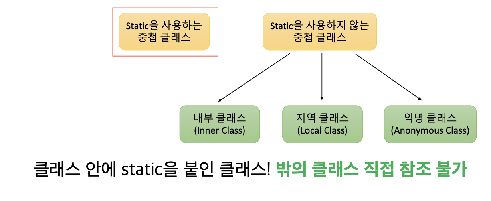

    - static 클래스, 내부 클래스 그림으로 정리

   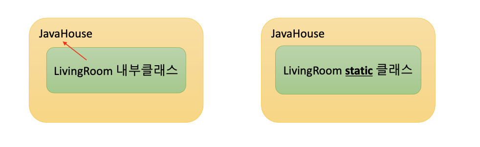

    - 이펙티브 자바 (ver.3)
        - 내부 클래스는 숨겨진 외부 클래스 정보를 가지고 있어, 참조를 해지하지 못하는 경우 메모리 누수가 생길 수 있고, 이를 디버깅 하기 어렵다.
        - 내부 클래스의 직렬화 형태가 명확하게 정의되지 않아 직렬화에 있어 제한이 있다.

    ⇒ 결론: **클래스 안에 클래스를 만들 때는 `static` 클래스를 사용하라**

2. 코틀린의 중첩 클래스와 내부 클래스
    - 중첩 클래스

    ```kotlin
    fun main() {
    }
    
    class House (
        private val address: String,
        private val livingRoom: LivingRoom
    ) {
        class LivingRoom(
            private val area: Double
    }
    ```

    - 내부 클래스 - `inner`를 앞에 추가해야함

    ```kotlin
    package lec13
    
    fun main() {
    }
    
    class House (
        private val address: String,
        private val livingRoom: LivingRoom
    ) {
        inner class LivingRoom(
            private val area: Double
        ) {
            val address: String
                get() = this@House.address
        }
    }
    ```

### 14장. 코틀린에서 다양한 클래스를 다루는 방법

1. Data Class
    - `data` 키워드를 붙여주면 equals, hashCode, toString을 자동으로 만들어준다.

    ```kotlin
    data class PersonDto (
        val name: String,
        val age: Int
    )
    ```

    - java에서는 jdk 16부터 kotlin의 data class 같은 record class를 도입함
2. Enum Class
    - 일반적으로 아래와 같이, 크게 다른 점은 없다.

    ```kotlin
    enum class Country (
        private val code: String
    ){
        KOREA("KO"),
        AMERICA("US");
    }
    ```

    - 하지만 when을 사용할 때, **Enum Class** 혹은 Sealed Class 와 함께 사용할 경우, 더욱더 진가를 발휘한다.
    - 컴파일러가 country의 모든 타입을 알고 있어 다른 타입에 대한 로직(else)을 작성하지 않아도 된다.

    ```kotlin
    private fun handleCountry(country: Country) {
        when(country) {
            Country.KOREA -> TODO()
            Country.AMERICA -> TODO()
        }
    }
    
    ```

3. Sealed Class, Sealed Interface
    - sealed → 사전적인 의미는 “봉인을 한”
    - 나오게 된 배경: 상속이 가능하도록 추상클래스를 만들고 싶은데, 외부에서는 이 클래스를 상속받지 않으면 좋겠다. → 하위 클래스를 **봉인**하자
    - 특징
        - Point: **`컴파일 타임` 때 하위 클래스의 타입을 모두 기억한다.** → 즉, 런타임때 클래스 타입이 추가될 수 없다.
        - 하위 클래스는 같은 패키지에 있어야 한다.
    - enum과 다른점
        - 클래스를 상속받을 수 있다.
        - 하위 클래스는 멀티 인스턴스가 가능하다.

    ```kotlin
    sealed class HyundaiCar (
        val name: String,
        val price: Long
    )
    
    class Avante : HyundaiCar("아반테", 1_000L)
    
    class Sonata : HyundaiCar("소나타", 2_000L)
    
    class Grandeur : HyundaiCar("그렌저", 3_000L)
    ```

    - sealed만 빼고 본다면, 추상 클래스와 전혀 다를게 없다.
    - 추상 메서드로 선언한다면, 하위 클래스에서 모두 구현을 해줘야 한다.
    - 추상화가 필요한 Entity or Dto에 sealed class를 활용한다.
    - enum class보다 유연하지만, 하위 클래스를 제한하는 `Sealed Class` 역시 when과 함께 주로 사용된다.

## 섹션4. 코틀린에서의 FP(함수형 프로그래밍)

### 15장. 코틀린에서 배열과 컬렉션을 다루는 방법

1. **배열**
- 실무에서는 배열보다 **리스트**를 주로 사용한다.

  ```kotlin
  fun main() {
      val array = arrayOf(100, 200)
      array.plus(300)
    
      for (i in array.indices) {
          println("${i} ${array[i]}")
      }
    
      for ((idx, value) in array.withIndex()) {
          println("$idx $value")
      }
  }
  ```

- `array.indices` 는 0부터 마지막 index까지의 Range이다.
- `array.withIndex()` 를 사용하면, 인덱스와 값을 한 번에 가져올 수 있다.
- `array.plus()` 를 통해 값을 쉽게 넣을 수도 있다.

2. **코틀린에서의 Collection → List, Set, Map**
- 컬렉션을 만들어줄 때 **불변**인지, **가변**인지를 설정해야 한다.

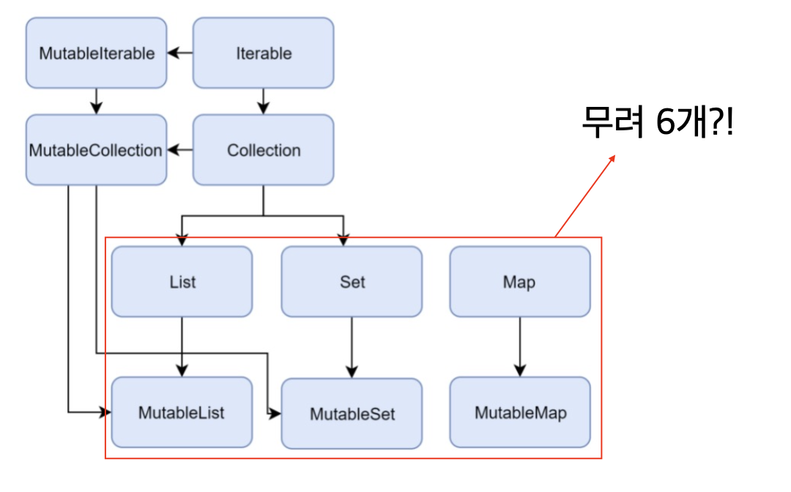  

- `가변(Mutable) 컬렉션`: 컬렉션에 element를 추가, 삭제할 수 있다.
- `불변 컬렉션`: 컬렉션에 element를 추가, 삭제할 수 없다.
- Collection을 만들자마자 Collections.unmodifiableList() 를 붙여준다. ⇒ 불변
- 또한, 불변 컬렉션일지라도 Reference Type인 Element의 필드는 바꿀 수 있다. ⇒ 필드 값 수정 가능

  1) List

  ```kotlin
  fun main() {
      val numbers = listOf(100, 200) // <Int> 생략 가능
      val emptyList = emptyList<Int>()
    
      printNumbers(emptyList())
  }
    
  private fun printNumbers(numbers: List<Int>) {
        
  }
  ```

  - listof() 를 통해 ‘불변 리스트’를 만든다.
  - 또한 emptyList<타입>() → 타입을 적어줘야 한다.
  - 만약, 타입을 추론할 수 있다면 생략 가능하다. → ex. printNubers() 메서드

  ```kotlin
  fun main() {
      val numbers = listOf(100, 200) //  불변 리스트. <Int> 생략 가능
      val numbers2 = mutableListOf(100, 200) // 가변 리스트
      val emptyList = emptyList<Int>()
    
      // List
      println(numbers[0]) // 첫번째 값 가져오기
    
      for (number in numbers) {
          println(number)
      }
    
      for ((idx, value) in numbers.withIndex()) {
          println("${idx} ${value}")
      }
  }
  ```

  - 가변(Mutable) 리스트의 기본 구현체는 ArrayList이고, 기타 사용법은 Java와 동일하다.
  - **[Tip] 우선 불변 리스트를 만들고, 꼭 필요한 경우 가변 리스트로 바꾼다.**

  2) Set(집합)

  - `Set`(집합)은 List와 다르게 순서가 없고, 같은 element는 하나만 존재할 수 있다. → 자료구조의 의미를 제외하고는 모든 기능이 List와 비슷하다.

  ```kotlin
  fun main() {
      val numbers = setOf(100, 200) //  불변 집합, <Int> 생략 가능
      val numbers2 = mutableSetOf(100, 200) // 가변 집합, 기본 구현체는 LinkedHashSet
    
      for (number in numbers) {
          println(number)
      }
    
      for ((index, number) in numbers.withIndex()) {
          println("$index $number")
      }
  }
    
  ```

  3) Map

  - kotlin도 동일하게 MutableMap 혹은 정적 팩토리 메서드를 활용할 수 있다.
  - 타입을 추론할 수 없기에, **타입을 지정한다.**
  - 가변 Map이기 때문에 `(key, value)`를 넣을 수 있다.
  - java 처럼 put을 쓸 수 있고, `map[key] = value` 을 쓸 수도 있다.
  - `mapOf(key to value)` 를 사용해 불변 map으로 만들 수 있다.

  ```kotlin
  fun main() {
      val map = mutableMapOf<Int, String>() // 타입을 추론할 수 없기에, 타입을 지정함
      map[1] = "MONDAY"
      map[2] = "TUESDAY"
    
      mapOf(1 to "MONDAY", 2 to "TUESDAY") // 불변 map으로 만듬
        
      for(key in map.keys) {
          println(key)
          println(map[key])
      }
    
      for((key, value) in map.entries) {
          println(key)
          println(value)
      }
  }
  ```

3. **컬렉션의 null 가능성, Java와 함께 사용하기**
- `List<Int?>` : **리스트에 null이 들어갈 수 있지만**, 리스트는 절대 null이 아님
- `List<Int>?` : 리스트에는 null이 들어갈 수 없지만, **리스트는 null일 수 있음**
- `List<Int?>?` : **리스트에 null이 들어갈 수도 있고, 리스트가 null일 수도 있음**
- ? 위치에 따라 null 의미가 달라진다.

   Java ↔ Kotlin

  - Java는 읽기 전용 컬렉션과 변경 가능 컬렉션을 구분하지 않는다.

  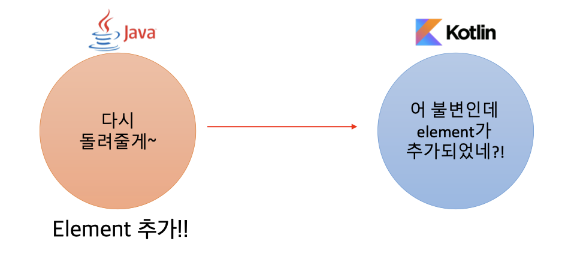

  - Java는 nullable 타입과 non-nullable 타입을 구분하지 않는다.
    
  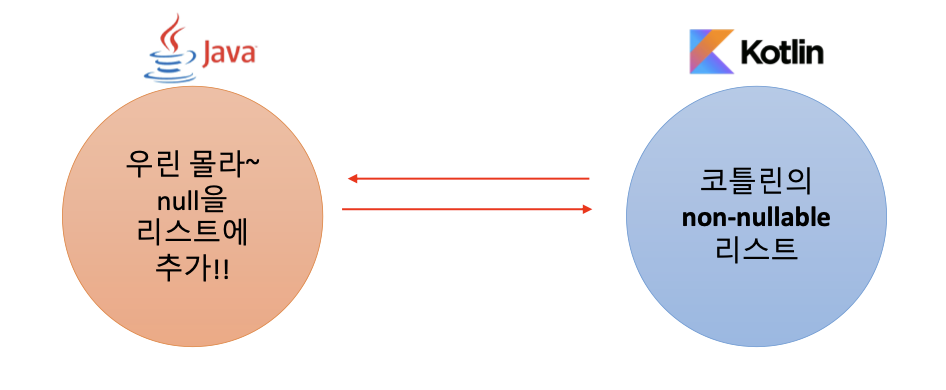

  - 정리: Kotlin 쪽의 컬렉션이 Java에서 호출되면 컬렉션 내용이 변할 수 있음을 감안해야 한다. 또는 코틀린쪽에서 `Collections.unmodifialbleXXX()`를 활용하면 자바에서의 변경 자체를 막을 수 있다.
  - Kotlin에서 Java 컬렉션을 가져다 사용할 때, **플랫폼 타입**을 신경써야 한다.

  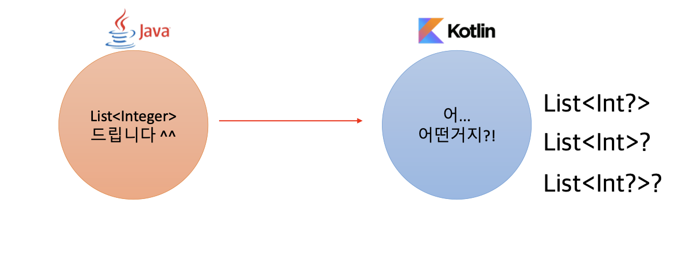

  - 정리: Java 코드를 보며, 맥락을 확인하고 Java 코드를 가져오는 지점을 wrapping 한다.

### 16장. 코틀린에서 다양한 함수를 다루는 방법

#### 1. 확장함수

- 나온 배경: 기존 Java 코드 위에 자연스럽게 Kotlin 코드를 추가할 수는 없을까?
- → 어떤 클래스 안에 있는 메서드처럼 호출할 수 있지만, 함수는 밖에 만들 수 있도록 한다.

fun `확장하려는클래스`.함수이름(파라미터): 리턴타입 {

// this를 이용해 실제 클래스 안의 값에 접근

}

→ 원래 String에 있는 멤버함수 처럼 사용할 수 있다.

```kotlin
fun main() {
    val str = "ABC"
    println(str.lastChar())
}

fun String.lastChar(): Char {
    return this[this.length - 1] // this를 통해 인스턴스에 접근이 가능
}

```

**확장함수 특징**

- 확장함수는 클래스에 있는 `private` 또는 `protected` 멤버를 가져올 수 없다.
- 확장함수와 멤버함수의 시그니처(메서드 이름)가 같다면, **`멤버함수`가 우선적으로 호출된다.**
- 또한, 확장함수를 만들었지만, 다른 기능의 똑같은 멤버함수가 생기면 오류가 발생할 수 있다.
- 확장함수가 오버라이드 된다면 → 해당 변수의 **현재 타입,** 즉 정적인 타입에 의해 어떤 확장함수가 호출될지 결정된다.

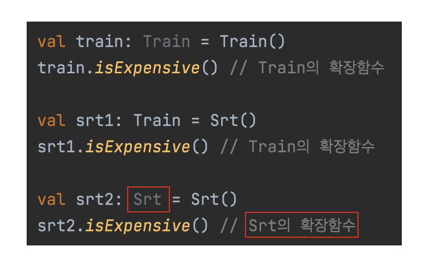

#### 2. infix함수

- 정의: **함수를 호출하는 새로운 방법**을 말한다.
- 형식: `변수 함수이름 argument`

  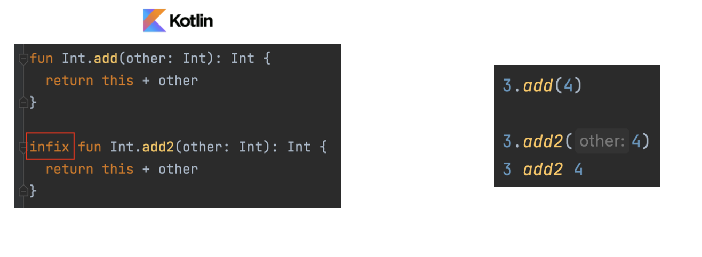
  
- `infix` 라는 키워드는 멤버 함수에도 붙일 수 있다.

#### 3. inline 함수

- 정의: 함수가 호출되는 대신, 함수를 호출한 지점에 함수 본문을 그대로 복붙하고 싶은 경우 사용한다.

  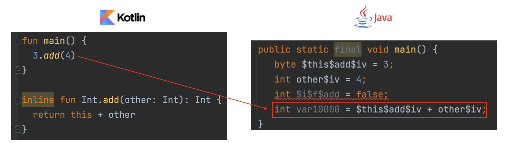

- 특징: 함수를 파라미터로 전달할 때에 오버헤드를 줄일 수 있다.
    - 하지만, inline 함수의 사용은 성능 측정과 함께 싡중하게 사용되어야 한다. 코틀린 라이브러리에서는 최적화를 어느 정도 해뒀기 때문에 적절하게 inline 함수가 붙어있다.

#### 4. 지역함수

- 정의: **함수 안에 함수를 선언**하는 걸 말한다.
- 예시: 함수로 추출하면 좋은데, 이 함수를 **지금 함수 내에서만 사용하고 싶을 경우**

  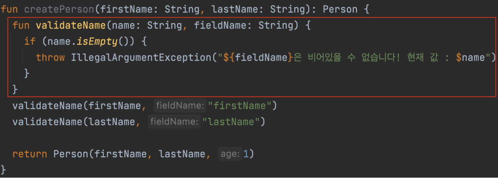

  - depth가 깊어지기도 하고, 그렇게 깔끔하지는 않다.
  - 실무에서는 거의 사용하지 않는다.