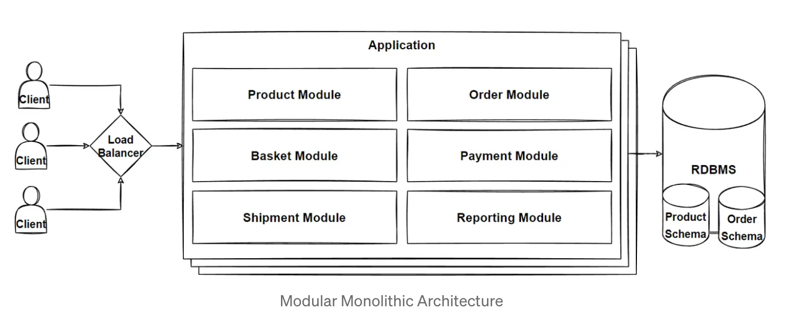
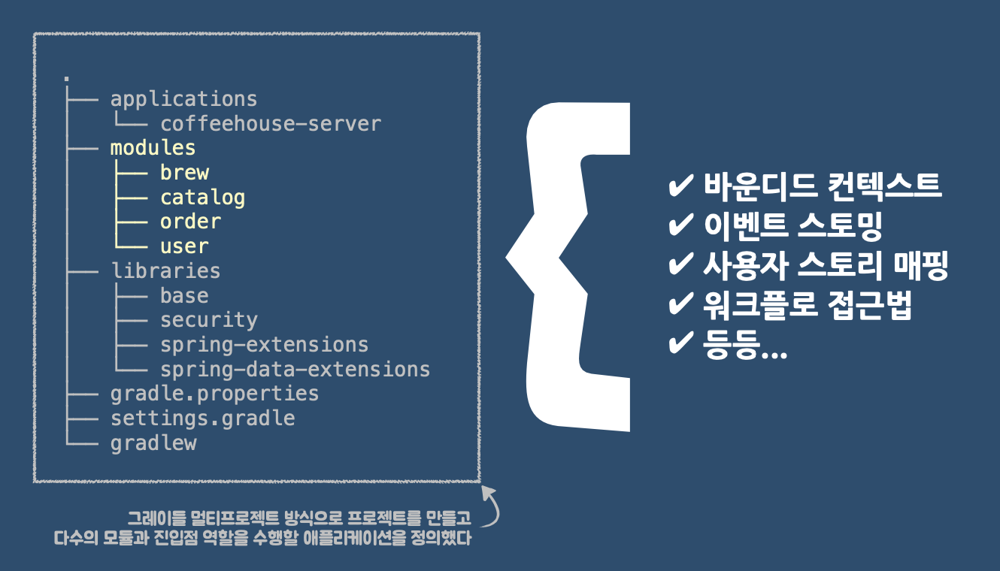
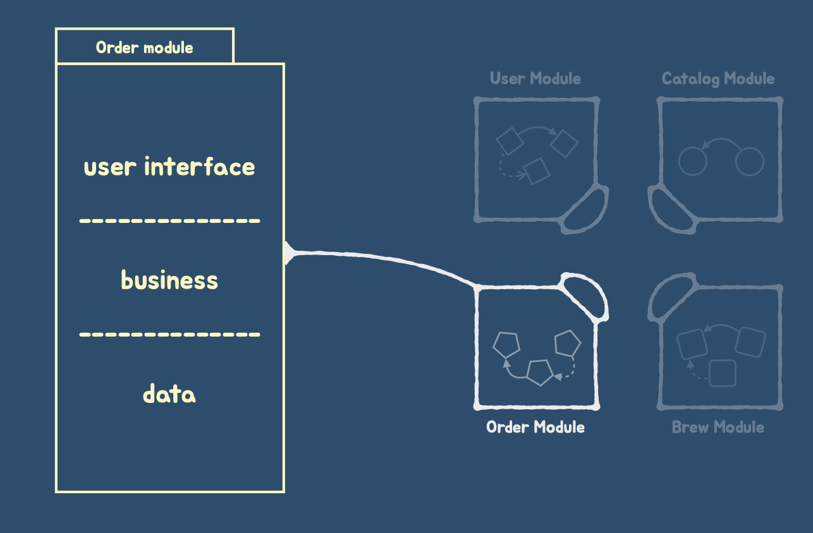
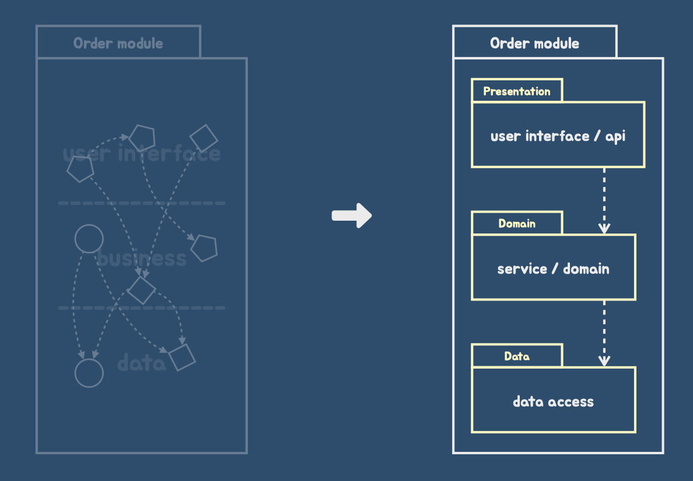
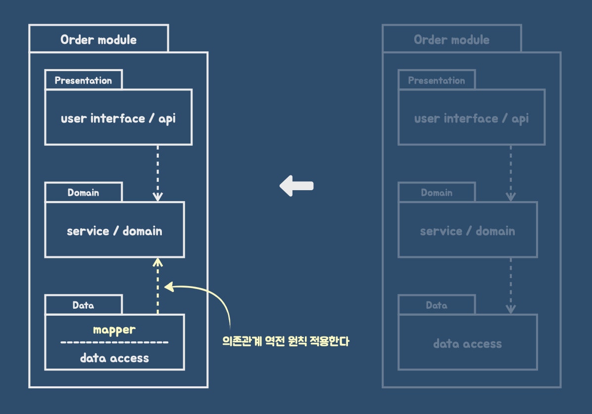
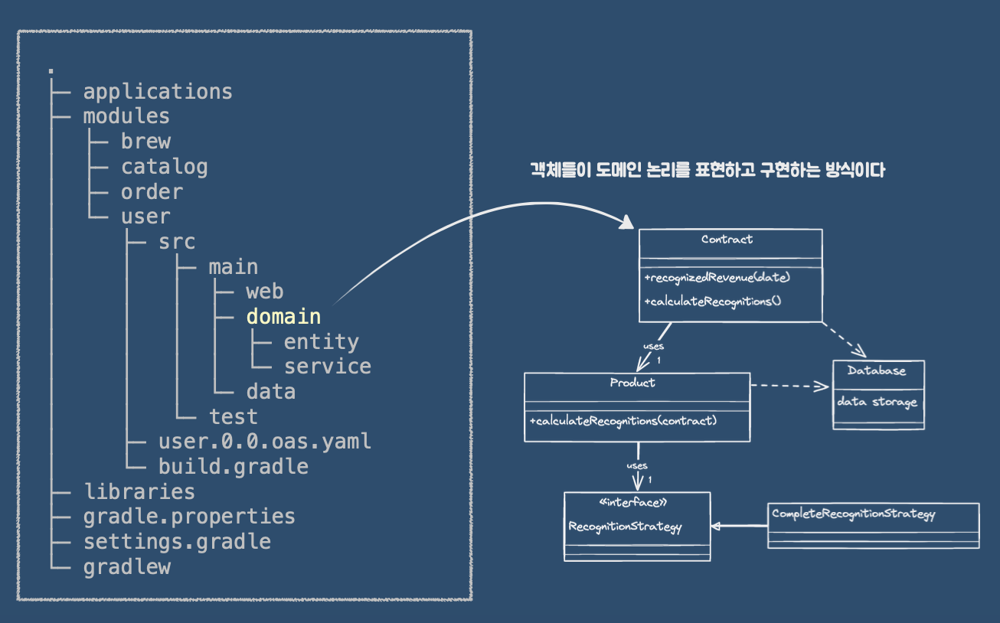
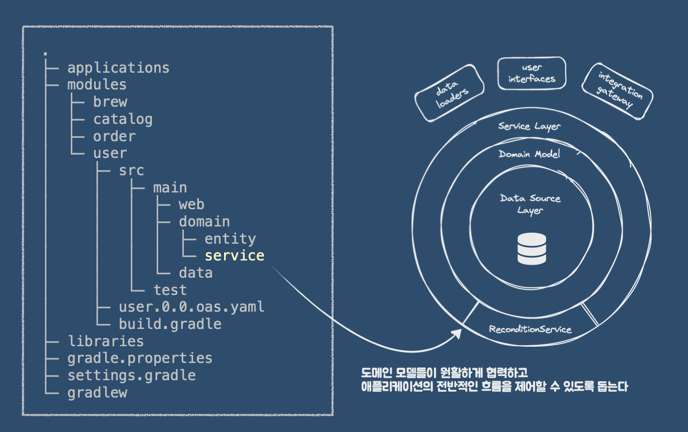

> 모듈러 모놀리스에 대해 간단히 알아보고자 이 글을 작성하게 되었다.

# 모듈러 모놀리스

## 꼭 마이크로서비스를 사용해야 하는가?

* 기존 단일 애플리케이션에서 전체 시스템을 구성하는 전통적인 모놀리스 아키텍처는 서비스가 성장함에 따라 다음과 같은 문제가 발생한다.

    * 방대한 코드베이스
    * 오래 걸리는 빌드와 테스트
    * 많은 커밋과 긴 배포까지의 시간
    * 스케일링의 어려움
    * 테스트 및 로직 격리의 어려움
    * 오래된 기술 스택 의존성

* 이러한 문제를 해결하기 위해 나온 방법이 `마이크로서비스` 이다.

* 하지만 마이크로서비스 역시 단점이 존재한다.

    * 시스템이 복잡해져서 개발, 테스트, 배포가 어렵고 리소스 비용이 증가하며 의존성이 얽히면 리팩토링 작업도 만만치 않다.

    * 또한 서비스간 DB를 분리하는 폴리그랏(polyglot)의 형태를 가져가지 않으면 실제로는 `분산 모놀리스`(Distributed Monolith)에 가깝다.

    * 결론적으로 이는 모놀리스 단점에 마이크로서비스 단점을 추가하는 셈이다.

* 2023년, [리처드슨의 인터뷰](https://www.youtube.com/watch?v=8BJUrHNFACA&ab_channel=%ED%95%9C%EB%B9%9B%EB%AF%B8%EB%94%94%EC%96%B4)에 따르면, 반드시 마이크로서비스가 필요한 것이 아니라 **느슨하게 결합하고 모듈화되고 테스트 가능하고 배포가 가능한 아키텍처가 필요하다**라고 말씀하셨다.

## 모놀리스 vs 마이크로서비스

### 모놀리스(Monolith)

* 복수의 바운디드 컨텍스트가 단일한 배포 단위로 애플리케이션 패키지로 구분이 되어있는 시스템

> 장점

* 리팩토링이 쉽다.
* 전체 시스템 테스트가 쉽다.

> 단점

* 명시적으로 관리하지 않으면 성능이 저하된다.
* 바운디드 컨텍스트 개별로 테스트하기가 어렵다.

### 마이크로서비스(Microservices)

* 배포의 단위의 경계가 바운디드 컨텍스트로 정의되어 있는 시스템

> 장점

* 바운디드 컨텍스트의 상호 작용은 원격으로 되어있다.
* 각각의 모듈 단위로 테스트할 수 있다.

> 단점

* 경계간 리팩토링이 어렵다.
* 전체 시스템 테스트가 어렵다.

## 모듈러 모놀리스(중간 지점의 선택지)

([Microservices Killer: Modular Monolithic Architecture](https://medium.com/design-microservices-architecture-with-patterns/microservices-killer-modular-monolithic-architecture-ac83814f6862))

* 모듈러 모놀리스 아키텍처는 **모듈화된 설계**의 장점과 **모놀리스 아키텍처**의 단순화을 결합한 소프트웨어이다.

    * 애플리케이션 전체를 하나의 배포 단위로 유지하면서도, 시스템을 여러 독립적인 모듈로 나누어 각 모듈이 특정 비즈니스 로직을 캡슐화한다.

    * 모듈을 명확하게 정의된 경계를 가지며, 다른 모듈과의 의존성도 명시적으로 관리한다.

> 특징

1. 비즈니스 로직 캡슐화

   * 각 모듈은 특정 비즈니스 로직을 포함하며, 필요한 경우 자체 데이터베이스 또는 스키마를 가질 수 있다.

2. 수직적 코드 분할

    * 비즈니스 기능에 따라 코드를 수직적으로 나눈다. 이를 통해 기술적 계층(예: 데이터 접근 계층, 서비스 계층) 간 의존성을 줄이고, 특정 비즈니스 요구에 따라 코드가 독립적으로 업데이트되도록 한다.

3. 단일 배포 단위

    * 모놀리스 아키텍처처럼 애플리케이션 전체를 하나의 배포 단위로 관리한다. 하지만 모듈화된 설계를 통해 확장성과 유지보수성을 높인다.

4. 미래의 마이크로서비스로의 전환 가능성

    * 모듈러 모놀리스는 필요에 따라 개별 모듈을 독립적인 마이크로서비스로 확장할 수 있도록 준비하는 데 적합하다.

> 좋은 아키텍처란 (모놀리스를 떠나서)

* 좋은 아키텍처는 시스템이 모놀리스 구조로 태어나서 단일 배포되더라도 이후에는 독립적으로 배포 가능한 단위들의 집합으로 성장해서 독립적인 서비스나 마이크로서비스 수준까지 나아가는 것이다.

* 또한 상황이 바꼈을 때 진행 방향을 반대로 해서 원래 형태인 모놀리스 구조로 되돌릴 수 있어야 한다.

## 스프링 모듈러 모놀리스

> 아래는 [모놀리식 시스템 분할과 정복](https://speakerdeck.com/arawn/monolrisig-siseutem-bunhalgwa-jeongbog)에 있는 자료를 기반으로 정리한 내용입니다.

* 아래와 같이 4가지 모듈로 시스템을 구분할 수 있다. (brew, catalog, order, user)

* 모듈은 수직 슬라이스로 구현한다. 아래는 `Order` 를 기준으로 그린 그림이다.

* `Order` 모듈 안에 3개의 Layered Architecture 를 적용했다. (Presentation - Domain - Data)

* 해당 아키텍처의 데이터 계층에 매퍼를 배치해 도메인의 독립성을 보장한다. 도메인은 순수 Java 객체로 남겨두고 Data 패키지 안에 mapper 클래스를 만들어 DB와 연결 맺도록 한다.

* 도메인 층에는 도메인 모델과 비즈니스 관련 로직, 그리고 DB와 연결 맺는 테이블 데이터(엔티티)가 존재한다.

> 도메인 모델

> 서비스 계층

## 참고자료

* [Modular Monolithic Architecture와 Spring Modulith](https://monday9pm.com/modular-architecture%EC%99%80-spring-modulith-43b6709b2937)

* [Microservices Killer: Modular Monolithic Architecture](https://medium.com/design-microservices-architecture-with-patterns/microservices-killer-modular-monolithic-architecture-ac83814f6862)

* [모놀리스 시스템 분할과 정복](https://speakerdeck.com/arawn/monolrisig-siseutem-bunhalgwa-jeongbog)
